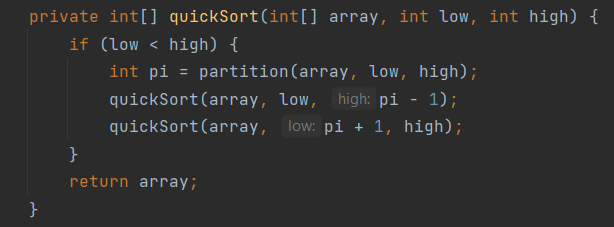
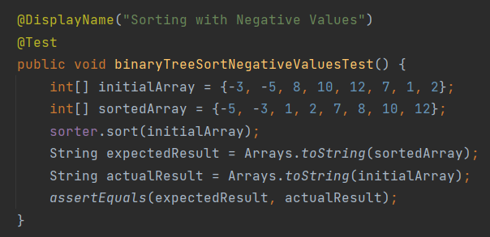

# Java Sorting Project 

This Java applications allows the user to input either an Array or ArrayList of Integers
to sort via the following algorithms:

* Quick Sort
* Bubble Sort
* Binary Tree Sort

This Java application also showcases:

* Logging
* MVC Architecture 
* Interfaces
* Exception Handling 
* SOLID Principles
* Nested Classes
* Unit Testing

### Bubble Sort Implementation

The image above shows the implementation of Bubble Sort within the application for both Arrays and ArrayLists.

An example of a test for BubbleSort looks like this:

A pre-sorted array is compared with an unsorted array that has gone through the Bubble Sort algorithm.

### Quick Sort Implementation

The images above show the implementation of Quick Sort within the application for both Arrays and ArrayLists.

An example of a test for Quick Sort looks like this:

A pre-sorted array is compared with an unsorted array that has gone through the Quick Sort algorithm.

### Binary Tree Sort Implementation

Creating the nested Node class:

The implementation of Binary Tree Sort within the application for both Arrays and ArrayLists:

An example of a test for Quick Sort looks like this:

A pre-sorted array is compared with an unsorted array (both including negative values) that has gone through the Binary Tree Sort algorithm.

## Other Features

### User Interface

When running the application, the user encounters this interface:

The user is promoted to input 1 or 2 depending on whether they'd prefer to sort an Array or Array List.

The user is then prompted to either input 1, 2 or 3 depending on which sorting algorithm to use.

The final result shows the unsorted data, the algorithm chosen, the sorted data and how long the process took.

### Logging and Exception Handling 

Due to the nature of the application, the user is only allowed to input single-digit integers that correspond to the
values shown in the UI prompts.

In order to insure the user inputs the correct type, exception handling and error logging was used.

To catch InputMismatchExceptions, try-catch blocks were used:

Console ouput if user enters anything except an Integer:

Console output if user enters an integer value outside the pre-defined range:

The error messages, alongside the exceptions are then stored in a file:

